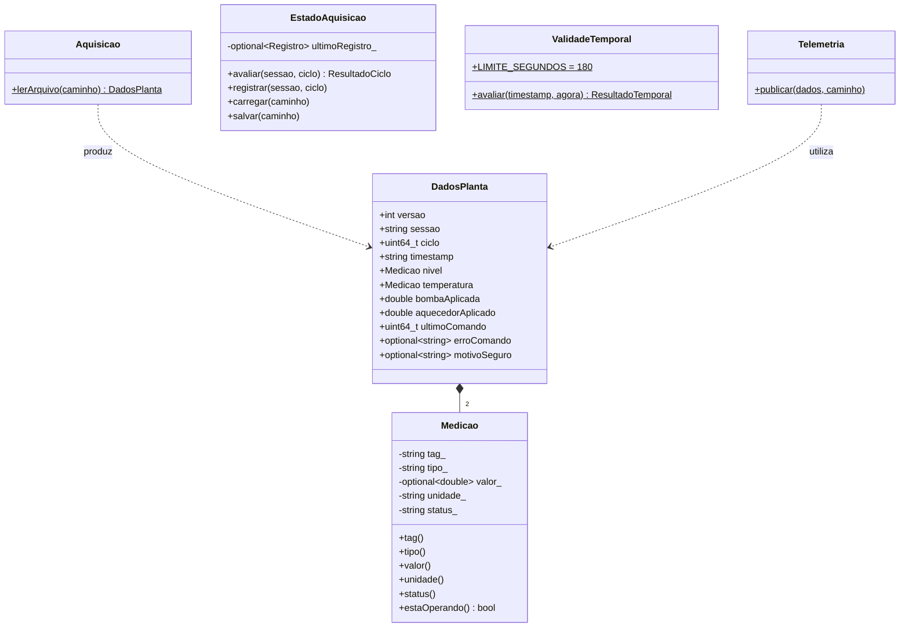
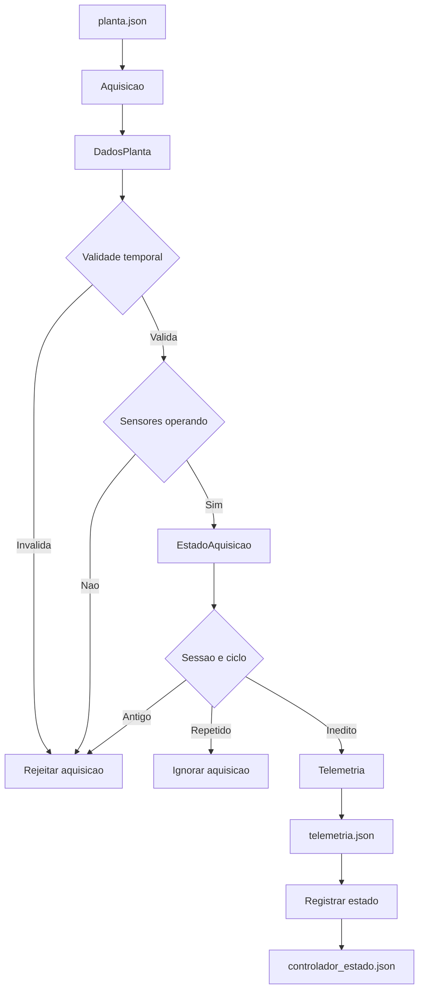

# Arquitetura — Controle e Supervisão de Tanque

## 1. Problema

Criar um sistema capaz de monitorar e controlar, de forma automática,
o nível e a temperatura de um tanque, através de uma bomba de
enchimento e um aquecedor.

## 2. Grandezas e atuadores

- Nível: LT-01, medido em %.
- Temperatura: TT-01, medida em C.
- Bomba: atuação entre 0% e 100%.
- Aquecedor: atuação entre 0% e 100%.

## 3. Objetivos de controle

Nível:
- Referência: 70%.
- Faixa desejada: 65% a 75%.

Temperatura:
- Referência: 30 °C.
- Faixa desejada: 28 °C a 32 °C.

## 4. Alarmes e estados

Alarmes previstos para as próximas etapas:

- NIVEL_CRITICO: nível < 5%.
- NIVEL_BAIXO: 5% <= nível < 20%.
- NIVEL_ALTO: nível > 90%.
- TEMP_BAIXA: temperatura < 22 °C.
- TEMP_ALTA: temperatura > 40 °C.

O nível crítico terá prioridade visual e será apresentado
em vermelho no supervisório.

O controlador já apresenta diagnóstico de aquisição ausente,
inválida ou obsoleta, além de identificar ciclos repetidos,
regressivos e reinícios da planta.

Na Etapa 01, a lista de alarmes da telemetria permanece vazia.

## 5. Estratégias de controle

As estratégias serão implementadas na Etapa 02.

Política 1 — ON/OFF com histerese:

- Bomba: liga abaixo de 65%, desliga a partir de 75%.
- Aquecedor: liga abaixo de 28 °C, desliga a partir de 32 °C.
- Entre os limites, mantém o estado anterior.

Política 2 — Controle por faixas:

Bomba:

- Abaixo de 5%: 100%.
- De 5% até abaixo de 50%: 70%.
- De 50% até abaixo de 70%: 50%.
- A partir de 70%: 0%.

Aquecedor:

- Abaixo de 22 °C: 100%.
- De 22 °C até abaixo de 26 °C: 70%.
- De 26 °C até abaixo de 30 °C: 50%.
- A partir de 30 °C: 0%.

## 6. Arquitetura

Planta Python:

- Simula as medições e responde aos atuadores.

Controlador C++:

- Lê e valida as aquisições.
- Identifica sessões e ciclos.
- Verifica a validade temporal dos dados.
- Persiste o último registro processado.
- Publica a telemetria.
- Executará uma política de controle na Etapa 02.
- Enviará comandos e acompanhará suas confirmações.
- Produzirá os alarmes previstos.

Supervisório Python/Streamlit:

- Apresentará medições, alarmes e gráficos.
- Registrará histórico em SQLite.
- Permitirá exportação CSV.

A comunicação é realizada pelos arquivos JSON definidos
em docs/CONTRATO.md.

### 6.1. Arquivos de comunicação

| Arquivo | Responsabilidade |
|---|---|
| planta.json | Aquisição produzida pela planta. |
| telemetria.json | Dados validados publicados pelo controlador. |
| controlador_estado.json | Registro da última sessão e ciclo processados. |
| comando_planta.json | Solicitação de atuação, a implementar na Etapa 02. |

O controlador utiliza a biblioteca nlohmann/json para
leitura e escrita dos documentos JSON.

A telemetria e o estado do controlador são publicados
por meio de arquivos temporários, seguidos de renomeação,
evitando a exposição de documentos parcialmente escritos.

### 6.2. Modos de execução

O controlador possui dois modos de execução.

Execução única:

```bash
./build/controlador --dados dados --uma-vez
```

Realiza uma tentativa de aquisição e encerra sem esperar.

Execução contínua:

```bash
./build/controlador --dados dados
```

Realiza tentativas de aquisição com intervalo de um segundo.

## 7. Padrões previstos

- Strategy: permite substituir políticas de controle.
- Command: organiza as solicitações e seus IDs.
- Repository: possibilidade para isolar o SQLite.

Esses padrões estão previstos para as próximas etapas
e ainda não foram implementados na Etapa 01.

## 8. Limitações da simulação

A planta é uma simulação didática, sem calibração física.

A bomba aumenta o nível em até 3 pontos percentuais
por ciclo, enquanto o consumo retira aproximadamente
1 ponto percentual por ciclo.

O aquecedor aumenta a temperatura em até 1,5 °C
por ciclo. Sem aquecimento, a temperatura tende
a se aproximar de 20 °C.

A planta também possui perturbações pseudoaleatórias:

- Nível: de -0,2 a +0,2 ponto percentual por ciclo.
- Temperatura: de -0,1 a +0,1 °C por ciclo.

O sistema possui aquecimento, mas não possui
resfriamento ativo nem esvaziamento controlado.

Os snapshots JSON representam apenas o estado
mais recente e podem perder ciclos.

A atuação expira após cinco ciclos sem um novo
comando válido, conforme a configuração padrão.

Os limites de alarme são didáticos e não representam
limites de segurança de uma instalação industrial.

### 8.1. Validade temporal

O prazo de obsolescência das aquisições foi definido
em 180 segundos (3 minutos).

Aquisições com idade superior a 180 segundos ou com
timestamp no futuro são rejeitadas pelo controlador.

Esse limite foi escolhido considerando o ambiente
didático e a realização de testes manuais.

A validade temporal da aquisição é independente
do prazo de expiração da atuação, contado em ciclos.

### 8.2. Limitações da persistência

O controlador armazena apenas a última sessão e
o último ciclo processado, não um histórico completo.

A publicação da telemetria e do estado é atômica
individualmente, mas não constitui uma transação
conjunta entre os dois arquivos.

## 9. Modelagem orientada a objetos

A arquitetura do controlador utiliza classes com
responsabilidades separadas.

### 9.1. Classes implementadas na Etapa 01

| Classe ou estrutura | Responsabilidade |
|---|---|
| Medicao | Representar e validar uma medição da planta. |
| DadosPlanta | Agrupar as informações de uma aquisição validada. |
| Aquisicao | Ler e validar o arquivo planta.json. |
| EstadoAquisicao | Identificar sessões e ciclos, registrar e persistir o último estado processado. |
| ValidadeTemporal | Verificar a idade das aquisições. |
| Telemetria | Converter e publicar os dados validados em telemetria.json. |

A função main coordena a execução do controlador,
delegando as responsabilidades às classes implementadas.

### 9.2. Diagrama de classes — Etapa 01


```mermaid
classDiagram
    class Medicao {
        -string tag_
        -string tipo_
        -optional~double~ valor_
        -string unidade_
        -string status_
        +tag()
        +tipo()
        +valor()
        +unidade()
        +status()
        +estaOperando() bool
    }

    class DadosPlanta {
        +int versao
        +string sessao
        +uint64_t ciclo
        +string timestamp
        +Medicao nivel
        +Medicao temperatura
        +double bombaAplicada
        +double aquecedorAplicado
        +uint64_t ultimoComando
        +optional~string~ erroComando
        +optional~string~ motivoSeguro
    }

    class Aquisicao {
        +lerArquivo(caminho)$ DadosPlanta
    }

    class EstadoAquisicao {
        -optional~Registro~ ultimoRegistro_
        +avaliar(sessao, ciclo) ResultadoCiclo
        +registrar(sessao, ciclo)
        +carregar(caminho)
        +salvar(caminho)
    }

    class ValidadeTemporal {
        +LIMITE_SEGUNDOS = 180$
        +avaliar(timestamp, agora)$ ResultadoTemporal
    }

    class Telemetria {
        +publicar(dados, caminho)$
    }

    DadosPlanta *-- "2" Medicao
    Aquisicao ..> DadosPlanta : produz
    Telemetria ..> DadosPlanta : utiliza
```

### 9.3. Fluxo de aquisição


```mermaid
flowchart TD
    A[planta.json] --> B[Aquisicao]
    B --> C[DadosPlanta]
    C --> D{Validade temporal}
    D -->|Invalida| X[Rejeitar aquisicao]
    D -->|Valida| E{Sensores operando}
    E -->|Nao| X
    E -->|Sim| F[EstadoAquisicao]
    F --> G{Sessao e ciclo}
    G -->|Repetido| H[Ignorar aquisicao]
    G -->|Antigo| X
    G -->|Inedito| I[Telemetria]
    I --> J[telemetria.json]
    J --> K[Registrar estado]
    K --> L[controlador_estado.json]
```

Aquisições inválidas não substituem a última telemetria
válida. Ciclos repetidos não são processados novamente.

### 9.4. Classes previstas para as próximas etapas

- Atuacao: representa os percentuais dos atuadores.
- PoliticaControle: define a interface das políticas.
- PoliticaOnOff: implementa controle com histerese.
- PoliticaFaixas: implementa controle por faixas.
- Comando: representa solicitações identificadas.
- AvaliadorAlarmes: avalia condições de alarme.
- Controlador: classe prevista para coordenar aquisição,
  decisão e atuação.

A modelagem será atualizada conforme a implementação
das próximas etapas.

## 10. Validação da Etapa 01

A implementação foi verificada por meio dos testes
oficiais fornecidos pelo professor e dos testes
autorais desenvolvidos em C++.

Resultados:

- 15 testes oficiais aprovados.
- 7 executáveis autorais C++ aprovados.
- Cobertura de linhas C++: 85,9%.
- Cobertura de funções C++: 100%.
- Cobertura de ramificações C++: 48,5%.

Também foram realizadas verificações manuais da
persistência, identificação de ciclos repetidos,
reinício da planta, rejeição de ciclos regressivos,
validade temporal e execução contínua.

As funcionalidades de controle automático e supervisão
serão implementadas nas etapas seguintes.
